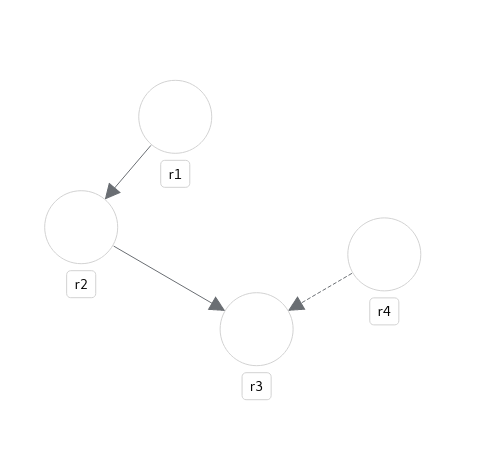

# Rule Visualization Demo

1. Run rule-visualization-backend (Requires Java 17+)

Open a terminal
```
cd rule-visualization-backend
```
```
mvn clean compile quarkus:dev
```
It starts Quarkus opening [http://localhost:8080/rules-visualizer](http://localhost:8080/rules-visualizer) REST endpoint

2. Run rule-visualization-frontend

Open a terminal
```
cd rule-visualization-frontend
```
```
npm install
```
```
npm start
```

It opens [http://localhost:3000](http://localhost:3000) with a browser.

The frontend posts a rules definition JSON to the backend service and get a topology JSON response.

The frontend renders the topology JSON.

